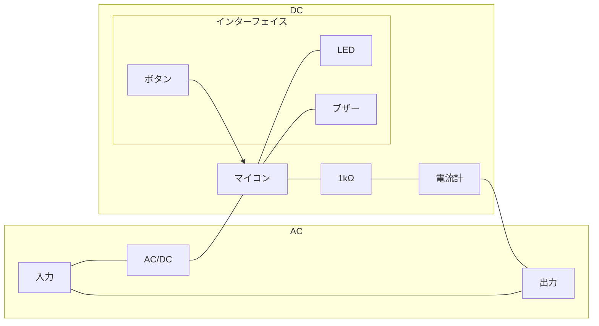

# アルティメットセーフティープラグ
アルティメットセーフティープラグは、家電製品などのタコ足配線による家電流を予防するためのタップです。

既存のタップに対して、以下のようなアドバンテージがあります。

- タコ足配線などによる過電流が流れる際、あるいは事前に警告
- 電気使用量のおおまかな表示が可能
- 積算電気使用量をWifiから確認可能

マイコン部分にESP32を搭載したM5AtomMatrixを使用することで、簡単にマイコンにダウンロードし、配線し、使用することができます。

このプロジェクトは高校での課外活動のために構築されましたが、MITライセンスで頒布されているためプロプライエタリ・フリーまたはオープンソースソフトウェアでこれらのコードの一部または全部を使用することができます。

## 使用方法
部品は次のものを使用します
|部品|商品名等|
|---|---|
|マイコン|M5Atom|
|ボタン|マイコンに内臓|
|LED|マイコンに内臓|
|ブザー|{ブザーの型番}|
|電流計|CTL-6-S32-8F-CL|

下図の通り部品を接続します


使用するポートは下表の通りです。
|ポート番号|部品|
|---|---|
|33|電流計(+)|
|G|電流計(-)|

## 開発方法
VS Codeでの開発方法をメモしておきます。

### 前提条件
VS Codeでアルティメットセーフティープラグの開発を行うには、次のソフトウェアが必要です。

- Visual Studio Code
- C/C++ for Visual Studio Code
- Arduino for Visual Studio Code
- arduino-snippets
- ArduinoIDE
- Git

### 開発開始
gitからこのリポジトリをクローンします。ターミナルで、下記のコマンドを実行します。

```sh
git clone https://github.com/taiseiue/ultimate-safety-plug
```

#### ボードを選択
下の設定バーからボードを「M5Stack-ATOM」、COMポートを接続されているポートに指定します。

#### コンパイルとアップロード
「Ctrl+Alt+R」でコンパイルが、「Ctrl+Alt+U」でアップロードができます。
#### シリアルモニタリング
アルティメットセーフティープラグは、電流をシリアル出力します。この出力をモニタリングするには、ArduinoIDEが必要です。